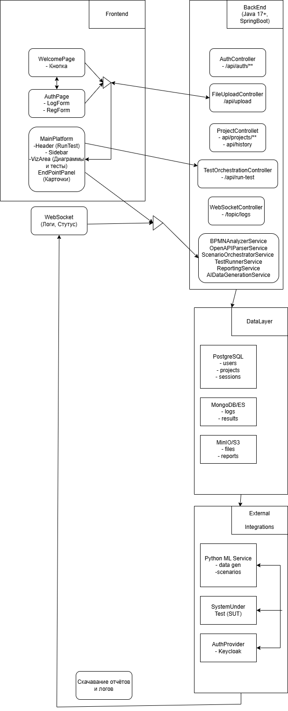
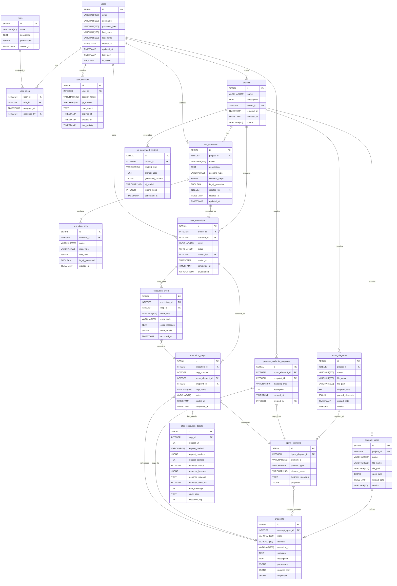
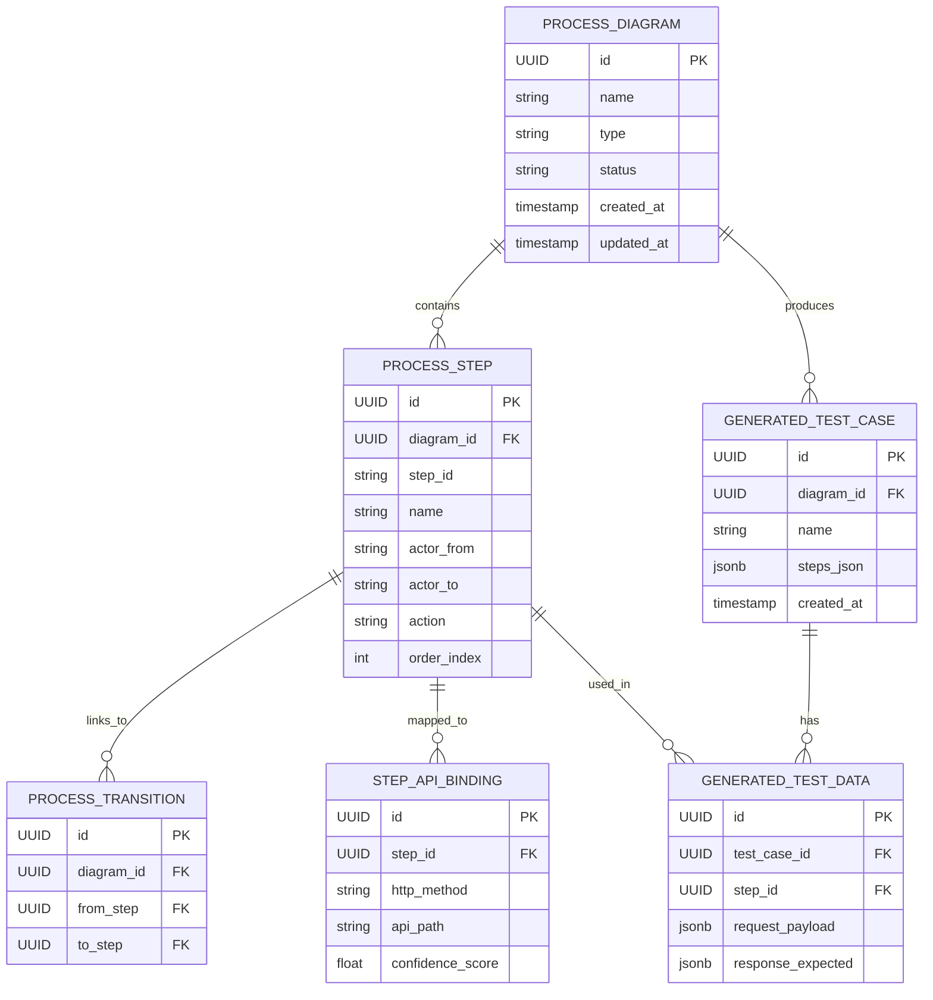

```mermaid
erDiagram
    users {
        SERIAL id PK
        VARCHAR(255) email
        VARCHAR(100) username
        VARCHAR(255) password_hash
        VARCHAR(100) first_name
        VARCHAR(100) last_name
        TIMESTAMP created_at
        TIMESTAMP updated_at
        TIMESTAMP last_login
        BOOLEAN is_active
    }
    
    roles {
        SERIAL id PK
        VARCHAR(50) name
        TEXT description
        JSONB permissions
        TIMESTAMP created_at
    }
    
    user_roles {
        INTEGER user_id FK
        INTEGER role_id FK
        TIMESTAMP assigned_at
        INTEGER assigned_by FK
    }
    
    user_sessions {
        SERIAL id PK
        INTEGER user_id FK
        VARCHAR(500) session_token
        VARCHAR(45) ip_address
        TEXT user_agent
        TIMESTAMP expires_at
        TIMESTAMP created_at
        TIMESTAMP last_activity
    }
    
    projects {
        SERIAL id PK
        VARCHAR(255) name
        TEXT description
        INTEGER owner_id FK
        TIMESTAMP created_at
        TIMESTAMP updated_at
        VARCHAR(20) status
    }
    
    bpmn_diagrams {
        SERIAL id PK
        INTEGER project_id FK
        VARCHAR(255) name
        VARCHAR(255) file_name
        VARCHAR(500) file_path
        XML diagram_data
        JSONB parsed_elements
        TIMESTAMP upload_date
        INTEGER version
    }
    
    openapi_specs {
        SERIAL id PK
        INTEGER project_id FK
        VARCHAR(255) name
        VARCHAR(255) file_name
        VARCHAR(500) file_path
        JSONB spec_data
        TIMESTAMP upload_date
        VARCHAR(50) version
    }
    
    endpoints {
        SERIAL id PK
        INTEGER openapi_spec_id FK
        VARCHAR(500) path
        VARCHAR(10) method
        VARCHAR(255) operation_id
        TEXT summary
        TEXT description
        JSONB parameters
        JSONB request_body
        JSONB responses
    }
    
    bpmn_elements {
        SERIAL id PK
        INTEGER bpmn_diagram_id FK
        VARCHAR(255) element_id
        VARCHAR(50) element_type
        VARCHAR(255) element_name
        TEXT business_meaning
        JSONB properties
    }
    
    process_endpoint_mapping {
        SERIAL id PK
        INTEGER bpmn_element_id FK
        INTEGER endpoint_id FK
        VARCHAR(50) mapping_type
        TEXT description
        TIMESTAMP created_at
        INTEGER created_by FK
    }
    
    test_scenarios {
        SERIAL id PK
        INTEGER project_id FK
        VARCHAR(255) name
        TEXT description
        VARCHAR(50) scenario_type
        JSONB scenario_steps
        BOOLEAN is_ai_generated
        INTEGER created_by FK
        TIMESTAMP created_at
        TIMESTAMP updated_at
    }
    
    test_data_sets {
        SERIAL id PK
        INTEGER scenario_id FK
        VARCHAR(255) name
        VARCHAR(50) data_type
        JSONB test_data
        BOOLEAN is_ai_generated
        TIMESTAMP created_at
    }
    
    test_executions {
        SERIAL id PK
        INTEGER project_id FK
        INTEGER scenario_id FK
        VARCHAR(255) name
        VARCHAR(20) status
        INTEGER started_by FK
        TIMESTAMP started_at
        TIMESTAMP completed_at
        VARCHAR(100) environment
    }
    
    execution_steps {
        SERIAL id PK
        INTEGER execution_id FK
        INTEGER step_number
        INTEGER bpmn_element_id FK
        INTEGER endpoint_id FK
        VARCHAR(255) step_name
        VARCHAR(20) status
        TIMESTAMP started_at
        TIMESTAMP completed_at
    }
    
    step_execution_details {
        SERIAL id PK
        INTEGER step_id FK
        TEXT request_url
        VARCHAR(10) request_method
        JSONB request_headers
        TEXT request_payload
        INTEGER response_status
        JSONB response_headers
        TEXT response_payload
        INTEGER response_time_ms
        TEXT error_message
        TEXT stack_trace
        TEXT execution_log
    }
    
    execution_errors {
        SERIAL id PK
        INTEGER execution_id FK
        INTEGER step_id FK
        VARCHAR(100) error_type
        VARCHAR(50) error_code
        TEXT error_message
        JSONB error_details
        TIMESTAMP occurred_at
    }
    
    ai_generated_content {
        SERIAL id PK
        INTEGER project_id FK
        VARCHAR(50) content_type
        TEXT prompt_used
        JSONB generated_content
        VARCHAR(100) ai_model
        INTEGER tokens_used
        TIMESTAMP generated_at
    }

    users ||--o{ user_roles : has
    roles ||--o{ user_roles : assigned_to
    users ||--o{ user_sessions : creates
    users ||--o{ projects : owns
    projects ||--o{ bpmn_diagrams : contains
    projects ||--o{ openapi_specs : contains
    projects ||--o{ test_scenarios : has
    projects ||--o{ test_executions : executes
    projects ||--o{ ai_generated_content : generates
    openapi_specs ||--o{ endpoints : defines
    bpmn_diagrams ||--o{ bpmn_elements : consists_of
    bpmn_elements }o--o{ endpoints : mapped_through
    process_endpoint_mapping }|--|| bpmn_elements : maps_from
    process_endpoint_mapping }|--|| endpoints : maps_to
    test_scenarios ||--o{ test_data_sets : contains
    test_scenarios ||--o{ test_executions : executed_as
    test_executions ||--o{ execution_steps : consists_of
    test_executions ||--o{ execution_errors : may_have
    execution_steps ||--|| step_execution_details : has_details
    execution_steps }o--|| bpmn_elements : references
    execution_steps }o--|| endpoints : references
    execution_errors }o--|| execution_steps : occurs_in
    users ||--o{ process_endpoint_mapping : creates
    users ||--o{ test_scenarios : creates
    users ||--o{ test_executions : starts
```

### Диаграмма таблиц из new.sql для bpmn и бизнес-процессов

```mermaid
erDiagram

    PROCESS_DIAGRAM ||--o{ PROCESS_STEP : contains
    PROCESS_STEP ||--o{ PROCESS_TRANSITION : links_to
    PROCESS_STEP ||--o{ STEP_API_BINDING : mapped_to
    PROCESS_DIAGRAM ||--o{ GENERATED_TEST_CASE : produces
    GENERATED_TEST_CASE ||--o{ GENERATED_TEST_DATA : has
    PROCESS_STEP ||--o{ GENERATED_TEST_DATA : used_in

    PROCESS_DIAGRAM {
        UUID id PK
        string name
        string type
        string status
        timestamp created_at
        timestamp updated_at
    }

    PROCESS_STEP {
        UUID id PK
        UUID diagram_id FK
        string step_id
        string name
        string actor_from
        string actor_to
        string action
        int order_index
    }

    PROCESS_TRANSITION {
        UUID id PK
        UUID diagram_id FK
        UUID from_step FK
        UUID to_step FK
    }

    STEP_API_BINDING {
        UUID id PK
        UUID step_id FK
        string http_method
        string api_path
        float confidence_score
    }

    GENERATED_TEST_CASE {
        UUID id PK
        UUID diagram_id FK
        string name
        jsonb steps_json
        timestamp created_at
    }

    GENERATED_TEST_DATA {
        UUID id PK
        UUID test_case_id FK
        UUID step_id FK
        jsonb request_payload
        jsonb response_expected
    }
```
